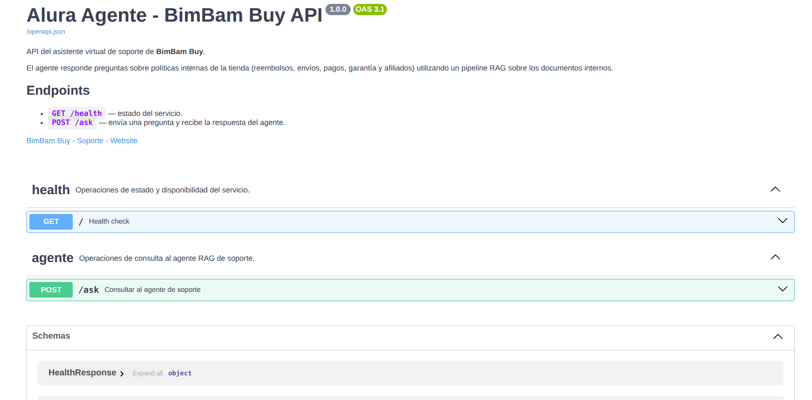
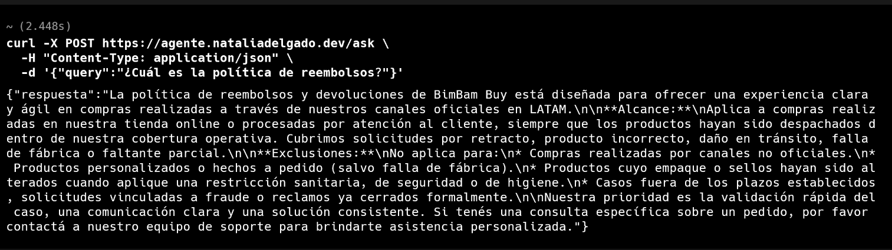

# BimBam Buy · Monorepo

Monorepo con dos proyectos **independientes**: cada uno vive en su propia carpeta,
tiene su propio `Dockerfile`, `README.md` y `.env.example`, y se deploya por separado
en Dokploy.

## Proyectos

| Proyecto | Stack | Carpeta | Container port | Documentación |
| --- | --- | --- | --- | --- |
| 🤖 **Backend** — Agente RAG | Python · FastAPI · LangChain · FAISS | [`backend/`](./backend/) | `8347` | [backend/README.md](./backend/README.md) |
| 💬 **Frontend** — Chat UI | React · TypeScript · Vite · Tailwind | [`frontend/`](./frontend/) | `4173` | [frontend/README.md](./frontend/README.md) |

## Demo

- **Backend (Swagger):** <https://agente.nataliadelgado.dev/docs>
- **Frontend:** _(completar cuando se deploye)_

## Screenshots

| Frontend | Backend |
| :---: | :---: |
|  |  |
|  |  |

Capturas detalladas y convenciones: [`frontend/screenshots/`](./frontend/screenshots/) y [`backend/screenshots/`](./backend/screenshots/).

## Despliegue en Dokploy

Cada servicio se construye desde el `Dockerfile` de su carpeta:

| Servicio | Path del Dockerfile (build context) | URL pública sugerida |
| --- | --- | --- |
| Backend | `backend/Dockerfile` | `https://agente.nataliadelgado.dev` |
| Frontend | `frontend/Dockerfile` | `https://chat.bimbambuy.com` |

> 📖 Para instrucciones detalladas de cada servicio (env vars, build args, troubleshooting),
> ver el `README.md` del proyecto correspondiente.

## Desarrollo local

Necesitás dos terminales:

```bash
# === Terminal 1: Backend ===
cd backend
pip install -r requirements.txt
cp .env.example .env             # completar GOOGLE_API_KEY
python src/vectorstore.py        # genera el índice FAISS (solo la primera vez)
uvicorn src.app:app --reload --port 8000

# === Terminal 2: Frontend ===
cd frontend
npm install
cp .env.example .env             # apuntar VITE_API_BASE_URL a http://localhost:8000
npm run dev                      # → http://localhost:5173
```

## Estructura

```
.
├── backend/                  # Agente RAG (Python + FastAPI)
│   ├── Dockerfile
│   ├── README.md
│   ├── data/                 # PDFs + índice FAISS
│   ├── requirements.txt
│   └── src/                  # agente, vectorstore, loader, app.py
└── frontend/                 # UI de chat (React + Vite)
    ├── Dockerfile
    ├── nginx.conf
    ├── README.md
    └── src/
        ├── components/       # UI presentacional
        ├── hooks/            # useChat, useApiRequest
        ├── types/            # contrato del backend
        └── lib/              # env helpers
```

> 🔌 **Importante**: si el frontend y el backend quedan en **dominios distintos**,
> hay que habilitar CORS en el backend. Ver [`frontend/README.md`](./frontend/README.md#-cors-no-te-olvides-del-backend).
