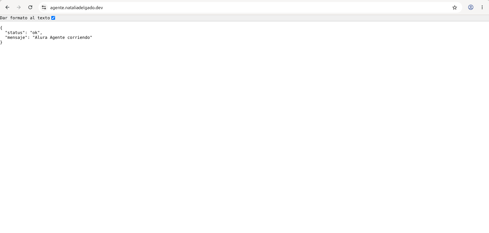

# Backend · Alura Agente — BimBam Buy

Servicio FastAPI que implementa un **agente RAG** sobre los documentos internos
de BimBam Buy (políticas de reembolsos, envíos, pagos, garantía y afiliados).
Este README se enfoca en la **arquitectura**, las decisiones técnicas y el
contrato de la API.

> Para instrucciones de instalación, dev local y deploy, ver el
> [`README.md` raíz](../README.md).

---

## 🧠 Arquitectura general

Pipeline RAG clásico de cuatro etapas, una por archivo:

```
data/ (PDFs)
   │
   ▼
loader.py          → PyPDFLoader + RecursiveCharacterTextSplitter (chunks de 800, overlap 100)
   │
   ▼
vectorstore.py     → embeddings (Google Gemini o local HF) + FAISS, con batching y pausas
   │                  (persiste en data/faiss_index/)
   ▼
agent.py           → retriever (k=4) + prompt de sistema + Gemini LLM → cadena RAG
   │
   ▼
app.py             → FastAPI con / (health) y /ask (POST), CORS configurado
```

### Componentes

| Archivo              | Responsabilidad                                                                                 |
| -------------------- | ----------------------------------------------------------------------------------------------- |
| `src/loader.py`      | Lee todos los `*.pdf` de `data/`, los pagina con `PyPDFLoader`, y los trocea con `RecursiveCharacterTextSplitter` (chunk 800 / overlap 100). |
| `src/vectorstore.py` | Genera embeddings por **lotes** (default 20) con pausas de 30 s para no agotar la cuota gratuita de Gemini, y persiste el índice FAISS en `src/data/faiss_index/`. |
| `src/agent.py`       | Construye la cadena RAG con `create_retrieval_chain` + `create_stuff_documents_chain` de LangChain. El retriever devuelve los **k=4** chunks más relevantes. |
| `src/config.py`      | Fábrica de embeddings según `PROVEEDOR_EMBEDDINGS` (`local` HuggingFace, `google` Gemini, `minimax`). |
| `src/app.py`         | Capa HTTP. Singleton del vectorstore y del agente al arrancar. CORS configurable por env.       |

## 🔁 Flujo de una consulta

1. **Inicio**: `app.py` carga el índice FAISS desde disco y arma la cadena RAG una sola vez.
2. **Request**: el frontend envía `POST /ask` con `{"query": "..."}`.
3. **Retrieval**: el retriever busca los **k=4** chunks más similares a la query.
4. **Prompting**: el prompt de sistema inyecta esos chunks como `context` y le pide al LLM que responda **solo** con esa información.
5. **Generación**: Gemini devuelve una respuesta en español, concisa y en tono de soporte.
6. **Response**: el backend devuelve `{"respuesta": "..."}` al frontend.

## 🧰 Decisiones técnicas

| Decisión | Por qué |
| --- | --- |
| **FAISS local** (no Pinecone/Chroma) | El dataset es chico (~5 PDFs) y el deploy es un contenedor simple: no necesitamos un servidor de vectores aparte. |
| **Embeddings swappeables** (`config.py`) | Permite comparar proveedores (HuggingFace local vs. Gemini) sin tocar el resto del código. |
| **Batching con pausas** en `vectorstore.py` | El free tier de Gemini tiene rate-limit estricto. 20 chunks cada 30 s evita el `429`. |
| **`langchain-classic`** | Alberga `create_retrieval_chain` y `create_stuff_documents_chain` (API estable, fuera del namespace nuevo). |
| **Singleton del agente** al bootear FastAPI | Inicializar el vectorstore y la cadena una vez evita pagar el costo en cada request. |
| **Sin streaming** todavía | El agente responde rápido (<3 s en promedio). Es la siguiente mejora planeada. |
| **`allow_dangerous_deserialization=True`** en `FAISS.load_local` | Necesario por el cambio de protocolo de FAISS en versiones recientes; el índice es nuestro, no viene de terceros. |

## 📡 API contract

Documentación interactiva: <https://agente.nataliadelgado.dev/docs>

### `GET /` — Health check

```http
GET / HTTP/1.1
```

```json
{ "status": "ok", "mensaje": "Alura Agente corriendo" }
```

Útil como `livenessProbe` y para verificar el deploy.

### `POST /ask` — Consultar al agente

```http
POST /ask
Content-Type: application/json

{ "query": "¿Cuál es la política de reembolsos?" }
```

**Response 200**

```json
{
  "respuesta": "Podés solicitar un reembolso dentro de los 30 días..."
}
```

**Response 422** (validación)

```json
{
  "detail": [
    { "loc": ["body", "query"], "msg": "Field required", "type": "missing" }
  ]
}
```

> El backend puede devolver campos extra (p. ej. `fuentes`); el frontend los
> ignora silenciosamente porque está tipado contra `AskResponse`.

## 🔐 Variables de entorno

| Variable                  | Default     | Descripción                                                                  |
| ------------------------- | ----------- | ---------------------------------------------------------------------------- |
| `GOOGLE_API_KEY`          | —           | Requerida para usar Gemini (LLM y/o embeddings). Gratis en [aistudio.google.com/apikey](https://aistudio.google.com/apikey). |
| `PROVEEDOR_EMBEDDINGS`    | `local`     | `local` (HuggingFace `all-MiniLM-L6-v2`), `google` (Gemini) o `minimax`.     |
| `MINIMAX_GROUP_ID`        | —           | Solo si `PROVEEDOR_EMBEDDINGS=minimax`.                                      |
| `MINIMAX_API_KEY`         | —           | Solo si `PROVEEDOR_EMBEDDINGS=minimax`.                                      |

> ⚠️ `dotenv` carga el `.env` desde la **carpeta del backend** (no desde `src/`),
> así que `cd backend && python src/vectorstore.py` funciona sin trampas.

## 🔌 CORS

Whitelist configurable en `src/app.py`:

```python
allow_origins=[
    "https://chat.nataliadelgado.dev",   # prod
    "http://localhost:5173",             # dev local del frontend
],
```

Para cambiar el dominio público del frontend, editá esa lista y redesplega.

## 🧪 Ejemplos de preguntas y respuestas

**P: ¿Cuál es la política de reembolsos?**

> La política de reembolsos y devoluciones de BimBam Buy está diseñada para
> ofrecer una experiencia clara y ágil en compras realizadas a través de
> nuestros canales oficiales en LATAM. Aplica a compras en tienda online o
> atención al cliente, cubriendo retracto, producto incorrecto, daño en
> tránsito, falla de fábrica o faltante parcial. No aplica a compras por
> canales no oficiales, productos personalizados, empaques alterados con
> restricción sanitaria/seguridad, o casos fuera de plazo o vinculados a
> fraude.

**P: ¿Cuánto tarda el envío?**

> El tiempo de entrega depende de la zona de cobertura: preparación
> (validación de pago 0-1 día hábil, alistamiento 1-2 días, despacho 1 día
> adicional) más entrega estimada de 2-5 días hábiles en zonas urbanas
> principales, 4-8 en zonas secundarias, y 6-12 en zonas de cobertura
> extendida. Puede variar según tamaño/peso del producto, inventario o
> factores externos.

**P: ¿Qué métodos de pago aceptan?**

> BimBam Buy acepta tarjeta de crédito, tarjeta de débito, transferencia
> bancaria, pago en efectivo en puntos habilitados, billeteras digitales
> según país, y cuotas o financiamiento cuando aplique. La disponibilidad
> varía según el país y se confirma en el checkout.

**P: ¿Cómo hago válida la garantía de un producto?**

> Hay que reportar la falla en tiempo razonable (48hs si es daño de
> transporte), proporcionar evidencia fotográfica o en video, conservar el
> comprobante de compra y no manipular el producto antes de la revisión.
> BimBam Buy evalúa si es una falla cubierta (fabricación, materiales o
> ensamblaje) y define reparación, cambio o reembolso. Si no hay falla, el
> caso se tramita como devolución, no como garantía.

## 📸 Screenshots

| Swagger UI | Health check | Endpoint `/ask` |
| :---: | :---: | :---: |
|  |  |  |
| Docs interactiva en `/docs` | Endpoint `/` respondiendo JSON | Request/response exitoso en `/ask` |

Más capturas (logs de Dokploy, deploys, etc.) y convenciones: ver
[`screenshots/README.md`](./screenshots/README.md).

## 📦 Dependencias clave (`requirements.txt`)

- `langchain`, `langchain-classic` — orquestación del RAG
- `langchain-google-genai`, `google-genai` — LLM y embeddings Gemini
- `langchain-community`, `langchain-text-splitters` — loaders y splitters
- `faiss-cpu` — vectorstore local
- `pypdf` — carga de PDFs
- `fastapi`, `uvicorn` — HTTP server
- `sentence-transformers` — embeddings locales (HuggingFace)
- `python-dotenv` — env vars