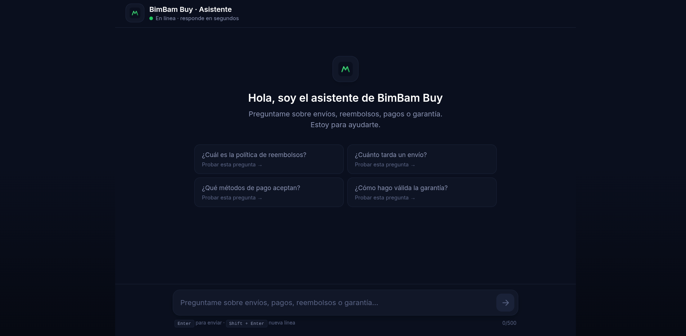
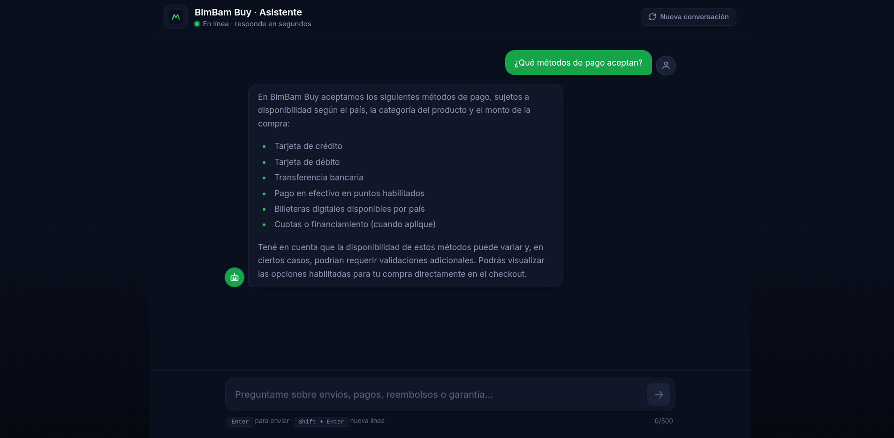
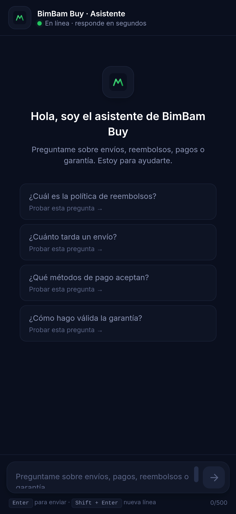

# Frontend · BimBam Buy Chat

UI de chat para el agente RAG de BimBam Buy. Permite a usuarios finales hacer
preguntas en lenguaje natural sobre envíos, reembolsos, pagos y garantía.

> Este proyecto es **independiente** del backend (`../backend/`). Solo consume el
> endpoint `POST /ask`. Para instrucciones de instalación, dev local y deploy,
> ver el [`README.md` raíz](../README.md).

---

## 🧠 Arquitectura

```
App.tsx                     # Shell mínimo: provee el hook y renderiza ChatWindow
└── ChatWindow              # Layout del chat (header + lista + input + errores)
    ├── ChatHeader          # Logo, branding, botón "nueva conversación"
    ├── ErrorBanner         # Banner de error con botón de cerrar
    ├── MessageBubble       # Burbuja (user/assistant) + estados
    │   └── MarkdownContent # Render seguro de markdown en respuestas
    ├── TypingIndicator     # Animación "escribiendo..." (3 dots)
    ├── EmptyState          # Estado inicial + 4 preguntas sugeridas
    └── InputBar            # Textarea + envío (Enter / Shift+Enter)

hooks/
├── useChat                 # Orquestador: historial + validación + estado
└── useApiRequest           # Cliente HTTP: fetch, timeout, parseo, errores

types/
└── chat                    # Contrato compartido con el backend + tipos UI

lib/
└── env                     # Helpers de variables VITE_*
```

### Capas y responsabilidades

| Capa            | Responsabilidad                                                                 |
| --------------- | ------------------------------------------------------------------------------- |
| `components/`   | Solo presentación. Reciben props, no manejan estado global ni hacen fetch.     |
| `hooks/`        | Toda la lógica: `useChat` orquesta mensajes; `useApiRequest` encapsula el HTTP. |
| `types/`        | Contrato del request/response del backend, compartido entre hooks y UI.         |
| `lib/`          | Helpers puros (acceso a variables de entorno).                                   |

Esta separación permite:
- **Testear `useChat` sin renderizar UI** (lógica pura).
- **Reutilizar `useApiRequest`** si mañana agregamos otro endpoint.
- **Cambiar estilos sin tocar lógica** y viceversa.

### Flujo de un mensaje

```
InputBar (Enter / click)
        │
        ▼
useChat.sendMessage(raw)
        │ ① validateQuery  → null si OK, mensaje si no
        │ ② append user message (status: sent)
        │ ③ append assistant placeholder (status: sending)
        ▼
useApiRequest.ask(query)
        │  POST {VITE_API_BASE_URL}/ask
        │  timeout: VITE_REQUEST_TIMEOUT_MS (default 30 s)
        ▼
backend (FastAPI) → Gemini
        │
        ▼
updateLastAssistantMessage(content, status: sent)
        │
        ▼ (si error)
setLocalError + burbuja con status: error + banner
```

### Decisiones técnicas

| Decisión | Por qué |
| --- | --- |
| **TypeScript strict, sin `any`** | El frontend es la "puerta de entrada" del contrato con el backend. Tipos estrictos evitan surprises en runtime. |
| **Sin librería UI externa** | El catálogo de componentes es chico (Header, Input, Bubble, Banner). Hand-rolled = menos bundle, menos vendor lock-in. |
| **Tailwind sin `@apply` custom** | Las clases utilitarias base alcanzan; mantener el compilador chico reduce la superficie de config. |
| **Hooks separados** (`useChat` / `useApiRequest`) | Single-responsibility: testing, razonamiento y futura reutilización. |
| **Errores genéricos al usuario, detalle a consola** | No exponer status codes ni payloads. La consola mantiene el rastro para devs. |
| **Placeholder optimista** ("sending") | Da feedback inmediato y permite reusar la misma animación para el typing indicator. |
| **Validación de input duplicada** (UX + backend) | El backend valida (422) pero la UX previene round-trips innecesarios. |
| **Markdown seguro** (`MarkdownContent`) | Las respuestas del LLM pueden traer formato. Sin `dangerouslySetInnerHTML`: se sanitiza antes de renderizar. |
| **Sin estado global** (Redux/Zustand) | El alcance del chat es chico; `useChat` ya encapsula lo necesario. |

## 🎨 Sistema de diseño

Inspirado en Platzi, ajustado a BimBam Buy:

- **Fondo**: azul marino casi negro (`#0a0f1e` → `#060912`)
- **Acento**: verde vibrante (`#22c55e`) para CTAs y estados activos
- **Tipografía**: Inter (sans-serif geométrica)
- **Movimiento**: fade-up en burbujas, dots animados para "escribiendo", hover/active en botones

Los tokens viven en `tailwind.config.js` y se consumen vía `bg-ink-900`,
`text-accent-500`, etc.

## 🔐 Variables de entorno

Copiá `.env.example` a `.env`:

```bash
cp .env.example .env
```

| Variable                  | Descripción                                  | Default                  |
| ------------------------- | -------------------------------------------- | ------------------------ |
| `VITE_API_BASE_URL`       | URL base del backend (sin slash final).      | `http://localhost:8000`  |
| `VITE_REQUEST_TIMEOUT_MS` | Timeout del request en milisegundos.         | `30000`                  |

> ⚠️ Vite solo expone al cliente las variables que arrancan con `VITE_`. No
> pongas secretos acá — todo lo que esté acá será visible en el bundle final.

## 📡 Contrato con el backend

**Endpoint:** `POST {VITE_API_BASE_URL}/ask`

**Request:**
```json
{ "query": "¿Cuál es la política de reembolsos?" }
```

**Response exitosa (200):**
```json
{ "respuesta": "La política de reembolsos…" }
```

> El backend puede devolver campos extra (`fuentes`, etc.); el frontend los
> ignora silenciosamente porque está tipado contra `AskResponse`.

## 🛡 Seguridad

- **XSS**: el contenido del backend se renderiza vía `MarkdownContent` con
  sanitización. React escapa automáticamente el texto plano; nunca usamos
  `dangerouslySetInnerHTML`.
- **Validación de input**: el input se trimea, se valida que no esté vacío y
  se acota a 500 caracteres antes de enviarse (en `useChat`).
- **Errores**: el frontend muestra mensajes genéricos
  ("No pudimos conectar con el asistente…") y loguea el detalle técnico a la
  consola para devs, sin exponer status codes ni payloads.
- **Rate-limiting UX**: el botón de envío y el textarea quedan deshabilitados
  mientras hay un request en curso, evitando spam.
- **URL sensible**: la URL del backend vive en `VITE_API_BASE_URL`, nunca
  hardcodeada en componentes.

## ♿ Accesibilidad

- Cada burbuja tiene un `aria-label` descriptivo.
- El indicador "escribiendo" usa `role="status"` con `aria-label`.
- El botón de cerrar el banner de error también está etiquetado.
- El input tiene `<label>` sr-only y atajos documentados (`Enter` / `Shift+Enter`).
- `prefers-reduced-motion` puede desactivarse: las animaciones usan duraciones
  cortas y opacas — no son invasivas.

## 📸 Screenshots

| Estado inicial | Conversación | Mobile |
| :---: | :---: | :---: |
|  |  |  |
| Pantalla inicial con las 4 preguntas sugeridas | Burbujas del usuario y del asistente | Vista responsive (iPhone 14) |

Más capturas y convenciones: ver [`screenshots/README.md`](./screenshots/README.md).

## 🛣 Roadmap (ideas para iterar)

- Streaming de respuestas con `ReadableStream` para perceived performance.
- Persistencia del historial en `localStorage`.
- Reintento automático del último mensaje ante error transitorio.
- Feedback 👍 / 👎 por respuesta (para futuro fine-tuning).
- Modo claro / oscuro.